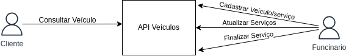

# mechanic_service

Um sistema para oficinas gerenciarem de forma trnasparente para os clientes o andamento dos serviços solicitados.
Nele, o cliente pode ver o andamento do serviço atrves de uma busca pela placa e uma palavra aleatoria recebida.
Os funcionarios da oficina podem iniciar serviço, estipular tempo do serviço, atualizar o andamento, adicionar dia-
gnostico, informar trocas e reparos de peças, finalizar e encerrar o serviço. De modo que o cliente pode acompanhar
o passo a passo, ter estimativas de tempo e custo do serviço. Ao iniciar um serviço o veiculo é cadastrado, com: 
nome do proprietario, modelo, cor, placa e ano de fabricação, e uma palavra chave é gerada para que o cliente possa
exclusivamente acompanhar o andamento. Apos o encerramento do serviço o veiculo, não mais ficará disponivel para con-
sulta, podendo ficar salvo na basede dados para futuros serviços.

